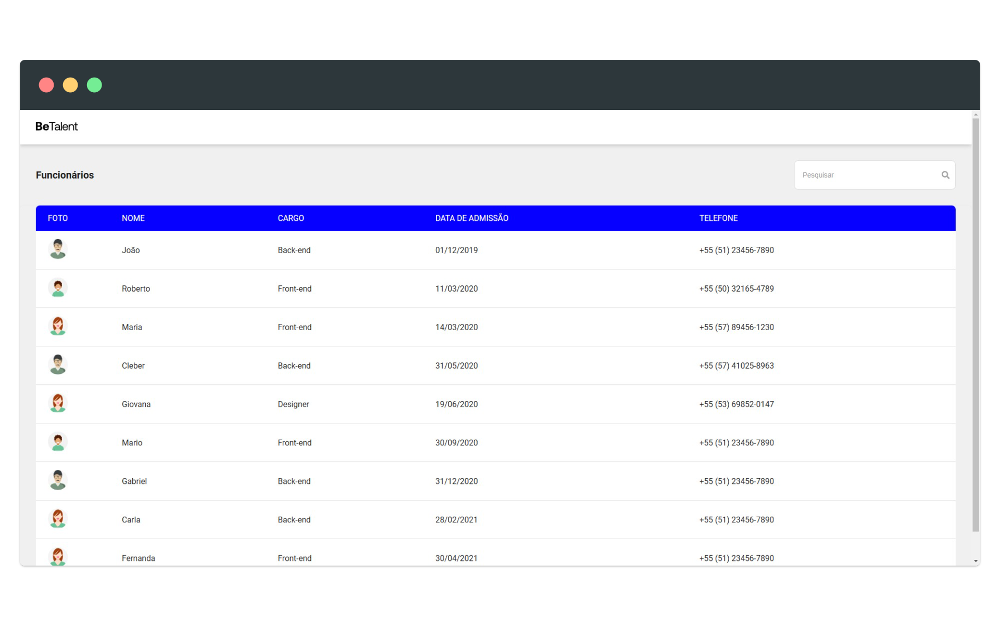
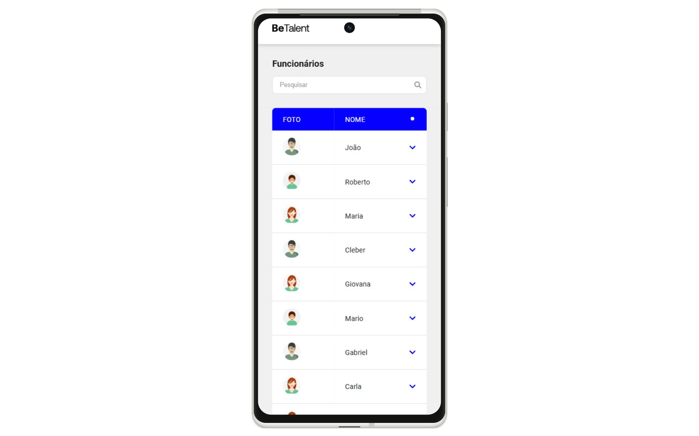

# BeTalent - Teste Técnico Frontend

## 📋 Sobre o Projeto

Este projeto foi desenvolvido como parte do processo seletivo para a vaga de Desenvolvedor Front-end na [BeTalent](https://betalent.tech). A aplicação consiste em uma interface para visualização e pesquisa de informações de funcionários, construída com React, TypeScript e Vite.

## 🚀 Funcionalidades

- **Listagem de Funcionários**: Visualização de todos os funcionários da empresa em uma tabela responsiva
- **Pesquisa**: Busca por nome, cargo ou telefone dos funcionários
- **Layout Responsivo**: Interface adaptável para dispositivos móveis e desktop
- **Detalhes Expansíveis**: Em dispositivos móveis, os detalhes dos funcionários podem ser expandidos com um clique

## 🛠️ Tecnologias Utilizadas

- **React 19**: Biblioteca para construção de interfaces
- **TypeScript**: Superset tipado de JavaScript
- **Vite**: Build tool e dev server
- **JSON Server**: Simulação de API REST para desenvolvimento
- **React Icons**: Biblioteca de ícones para React

## 🎨 Design

O design da aplicação foi baseado no layout fornecido pela BeTalent, disponível no [Figma](https://www.figma.com/design/yw6th52zE9bubewc6ayTg5/Teste-T%C3%A9cnico-Frontend-BeTalent)

## 🖼️ Screenshots

|  |  |
|:---------------------------------------:|:-------------------------------------:|
| **Versão Desktop**                      | **Versão Mobile**                     |

## 📦 Instalação e Uso

### Pré-requisitos

- Node.js (versão 18 ou superior)
- npm ou yarn

### Configuração

1. Clone o repositório:

   ```bash
   git clone git@github.com:andersonssantana/betalent-people.git
   cd betalent-people
   ```bash

2. Instale as dependências:

   ```bash
   npm install
   # ou
   yarn
   ```

3. Inicie o JSON Server (API mock):

   ```bash
   npm run server
   # ou
   yarn server
   ```

4. Em outra janela de terminal, inicie a aplicação:

   ```bash
   npm run dev
   # ou
   yarn dev
   ```

5. Acesse a aplicação em [http://localhost:5173](http://localhost:5173)

## 📱 Responsividade

A aplicação foi desenvolvida com foco em responsividade:

- **Mobile-First**: Toda a estilização CSS foi implementada seguindo a abordagem mobile-first, priorizando a experiência em dispositivos móveis e expandindo progressivamente para telas maiores
- **Desktop**: Exibe todas as colunas da tabela de funcionários
- **Mobile**: Exibe uma versão compacta com opção de expandir para ver mais detalhes

## 🧪 Estrutura do Projeto

```bash
src/
├── assets/        # Arquivos estáticos (imagens, ícones)
├── components/    # Componentes React reutilizáveis
│   ├── EmployeeRow/     # Componente de linha de funcionário
│   ├── EmployeeTable/   # Tabela de funcionários
│   ├── Header/          # Cabeçalho da aplicação
│   └── Loading/         # Componente de carregamento
├── utils/         # Funções utilitárias
├── types.ts       # Definições de tipos TypeScript
└── App.tsx        # Componente principal
```

## 🔍 Funcionalidades Adicionais

- **Formatação de Dados**: Funções para formatar telefones e datas
- **Tratamento de Erros**: Feedback visual durante carregamento e em caso de erros
- **Animações**: Transições suaves ao expandir/colapsar informações
- **Pesquisa em Tempo Real**: Filtragem dinâmica dos resultados conforme o usuário digita

## 👨‍💻 Autor

Desenvolvido como parte do processo seletivo para a vaga de Desenvolvedor Front-end na BeTalent.

### Contato

- **Nome:** Anderson Santana
- **E-mail:** [anderssantana@outlook.com](mailto:anderssantana@outlook.com)
- **GitHub:** [github.com/andersonssantana](https://github.com/andersonssantana/)
- **LinkedIn:** [linkedin.com/in/andersonssantana](https://www.linkedin.com/in/andersonssantana/)
